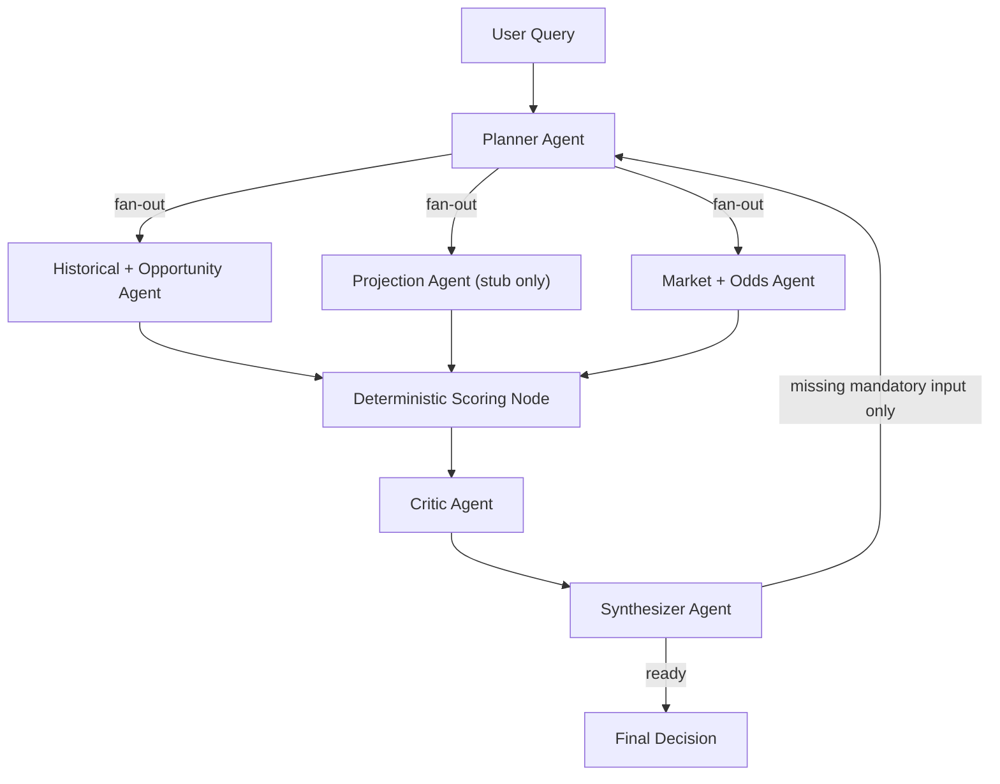

# NBA Multi-Agent Betting Advisor

This project is an implementation of a multi-agent system for Generative AI Assignment 4. The system uses `LangGraph` to coordinate multiple LLM agents and combines NBA historical data, live odds, and lineup information to provide analysis results for player props. It also features an interactive web front-end for users to input questions and view responses directly.

## System Architecture



This diagram shows the main LangGraph flow used by the project: the planner routes work to the analysis agents, the deterministic scoring node aggregates the signals, the critic checks risk and contradictions, and the synthesizer produces the final recommendation.

## Assignment Requirements Mapping

- At least 2 LLM-based agents: This project currently includes several agents such as `planner`, `historical_agent`, `projection_agent`, `market_agent`, `critic`, and `synthesizer`
- Agent framework: Uses `LangGraph`
- Front-end: Provides a `Next.js` web interface, and a CLI entry point via `scripts/agents/cli.py`
- README requirement: This document explains how to launch the project and obtain necessary data

## Project Features

- Query NBA games and player props information
- Display vig-free probabilities and market consensus
- Analyze player historical game data
- Integrate live odds, lineups, and agent analysis results
- Interact with the multi-agent system via the front-end Agent Widget

## Tech Stack

### Backend

- `FastAPI`
- `LangGraph`
- `Redis`
- `PostgreSQL`
- `HTTPX`
- `Pydantic`

### Frontend

- `Next.js 14`
- `TypeScript`
- `Tailwind CSS`
- `TanStack Query`

## 1. How to Start the Project

### Prerequisites

- `Docker` and `Docker Compose`
- `Node.js 18+`
- `Python 3.11+`
- `The Odds API` key: <https://the-odds-api.com/>
- `OpenAI API` key: Needed for agent chat functionality

### Recommended: Start Backend with Docker, Frontend Locally

1. Copy the environment variables file

```bash
cp env.example .env
```

2. Edit the root `.env` file

At minimum, fill in the following two fields:

```bash
ODDS_API_KEY=your_odds_api_key_here
OPENAI_API_KEY=your_openai_api_key_here
```

Notes:

- `ODDS_API_KEY` is used to fetch live odds data
- `OPENAI_API_KEY` is needed to enable multi-agent chat/analysis features
- `SPORTSDATA_API_KEY` is optional – you can start the project without it

3. Start the backend, Redis, and PostgreSQL

```bash
docker compose up --build -d
```

4. Check if backend started normally

```bash
docker compose logs -f backend
```

5. Start the frontend

```bash
cd frontend
npm install
npm run dev
```

6. Open the project in your browser

- Frontend homepage: <http://localhost:3000>
- Backend API: <http://localhost:8000>
- Swagger docs: <http://localhost:8000/docs>

### Local Development (No Docker)

If you want to run everything locally for development, use the following method. This is more suitable for development and not the main recommended workflow for grading.

#### Backend

```bash
cd backend
python -m venv .venv
source .venv/bin/activate
pip install -r requirements.txt
uvicorn app.main:app --reload --host 0.0.0.0 --port 8000
```

Notes:

- If not using Docker, you should start `Redis` yourself
- If `PostgreSQL` isn't running, some persistence features might not work, but the API may launch with downgraded functionality

#### Frontend

```bash
cd frontend
npm install
npm run dev
```

If you need to explicitly specify the API endpoint for frontend requests, create `frontend/.env.local`:

```bash
NEXT_PUBLIC_API_URL=http://localhost:8000
```

## 2. How to Obtain Required Data

Assignment 4 requires the README to explain "where to download the data." This project uses two types of data: static historical data and real-time external data.

### A. Historical Data CSV

The project uses a player game logs data file:

- Target path: `data/nba_player_game_logs.csv`
- Original source: <https://github.com/eason034056/nba-player-stats-scraper/blob/main/nba_player_game_logs.csv>
- Direct download: <https://raw.githubusercontent.com/eason034056/nba-player-stats-scraper/main/nba_player_game_logs.csv>

If your cloned repo doesn't have this file, run:

```bash
mkdir -p data
curl -L "https://raw.githubusercontent.com/eason034056/nba-player-stats-scraper/main/nba_player_game_logs.csv" -o data/nba_player_game_logs.csv
```

### B. Use API to Download CSV Automatically

After starting the backend, you can also call the API to have the system download the CSV to the `data/` directory:

```bash
curl -X POST http://localhost:8000/api/trigger-csv-download
```

To check the scheduler and CSV status:

```bash
curl http://localhost:8000/api/scheduler-status
```

### C. Real-Time External Data

You do not need to manually download the following data files; the system fetches them live when running:

- Real-time odds data: from `The Odds API`
- Starting lineups and injury status: from `RotoWire` and `RotoGrinders`

To fully use the project, make sure:

1. You have prepared API keys in `.env`
2. `data/nba_player_game_logs.csv` exists (or download it using the above API/command)

## 3. Interaction Methods

### Web Front-End

After going to <http://localhost:3000>, you can:

- View games and player props
- Use Agent Widget to ask analysis questions
- View odds, lineup, historical context, and more

### CLI Front-End

If you want to use the multi-agent system directly via command line:

```bash
cd scripts/agents
python cli.py "Should I bet Curry over 28.5 points tonight?"
```

To enter interactive mode:

```bash
cd scripts/agents
python cli.py
```

## 4. Testing and Utility Commands

### Backend Tests

```bash
cd backend
pytest
```

### Frontend Tests

```bash
cd frontend
npm test
```

### Export LangGraph Mermaid Diagram

Assignment requires a graph visualization. You can export the LangGraph Mermaid diagram with:

```bash
cd scripts/agents
python graph.py
```

## 5. Project Structure

```text
.
├── backend/                 # FastAPI backend
├── frontend/                # Next.js frontend
├── scripts/agents/          # LangGraph multi-agent system and CLI
├── data/                    # Local data files (includes nba_player_game_logs.csv)
├── docker-compose.yml       # Backend, Redis, PostgreSQL launch configuration
├── env.example              # Environment variable example
└── README.md
```

