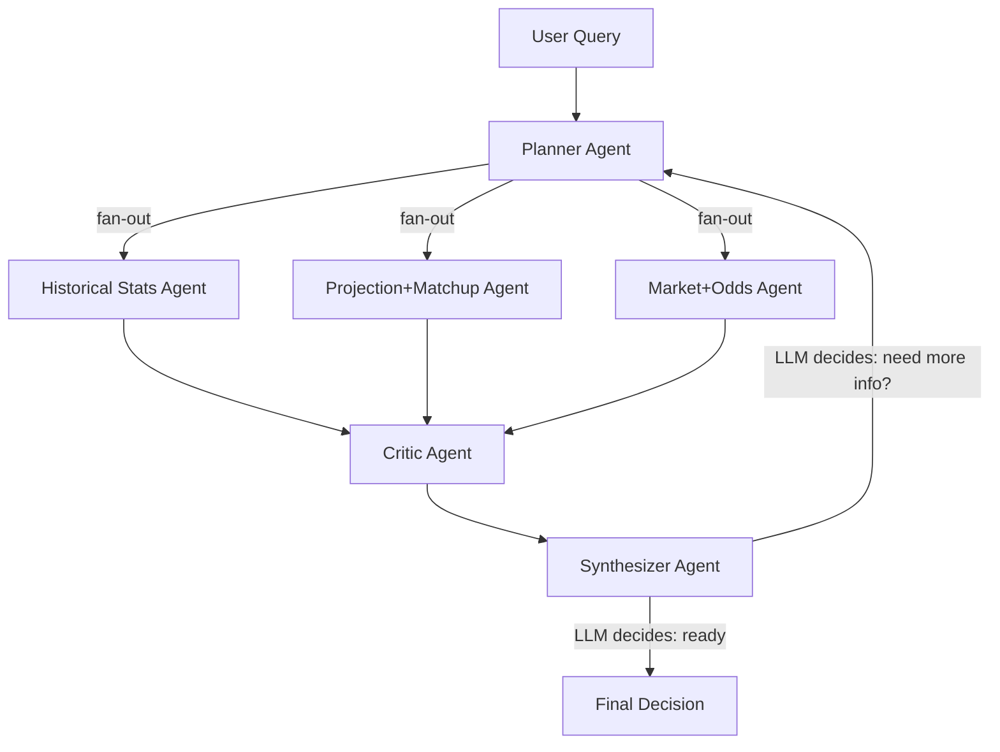

# NBA Multi-Agent Betting Advisor (Assignment 4)

## Problem: Current Analysis is Too Shallow

The existing `daily_analysis.py` only looks at **one dimension**: historical over/under rate. A real betting analyst considers at least 7 dimensions. The CSV has 28 columns but only 9 are used. The projection API returns 30+ fields but only 4 are consulted for decision-making.

## Architecture: 5 Agents, 7 Analysis Dimensions, 17 Tools




All routing decisions (which agents to invoke, whether to loop back) are made by LLMs, never hard-coded `if/else`.

---

## The 7 Analysis Dimensions (Current vs Proposed)


| #   | Dimension              | Currently Used?                            | Data Source                                  |
| --- | ---------------------- | ------------------------------------------ | -------------------------------------------- |
| 1   | Base over/under rate   | Yes (p_over, p_under)                      | CSV: PTS, AST, REB                           |
| 2   | Trend / Momentum       | **No**                                     | CSV: Date + values (rolling avg, streaks)    |
| 3   | Shooting Efficiency    | **No**                                     | CSV: FG%, 3P%, FT%, FGA, FTA                 |
| 4   | Variance / Consistency | **No**                                     | CSV: std, CV, floor/ceiling percentiles      |
| 5   | Schedule / Context     | **No**                                     | CSV: Date (rest days), W/L (game script)     |
| 6   | Projection + Matchup   | **Stub only** (SportsDataIO is dummy data) | SportsDataIO: minutes, usage%, PER, opp rank |
| 7   | Market / Line Movement | **No**                                     | Odds API + PostgreSQL odds_line_snapshots    |


---

## Agent Details

### Agent 1: Planner

- **Role**: Parse user query, extract (player, metric, threshold, date), decide which analysis paths are needed.
- **LLM decides**: If user asks "Is Curry a good bet tonight?" the LLM figures out it needs all 3 analysis agents. If user asks "How consistent is Jokic on rebounds?" it might only invoke Stats Agent.
- **No tools** -- pure reasoning node.

### Agent 2: Historical Stats Agent

Deepest agent. Has access to **12 tool functions** covering Dimensions 1-5.

**Dimension 1 -- Base Stats** (wraps existing `csv_player_service.get_player_stats`):

- `get_base_stats(player, metric, threshold, n)` -- p_over, p_under, mean, std, n_games
- `get_starter_bench_split(player, metric, threshold)` -- compares Starter vs Bench stats
- `get_opponent_history(player, metric, threshold, opponent)` -- vs specific team
- `get_teammate_impact(player, metric, threshold, teammate, played)` -- with/without a specific star

**Dimension 1b -- Real-time Injury + Teammate Chemistry Analysis** (NEW, reuses `nba_lineup_rag` scraper):

- `get_injury_report(team)` -- **real-time injury data** by importing `InjuriesPageFetcher` from [nba_lineup_rag/src/sources/injuries_pages.py](nba_lineup_rag/src/sources/injuries_pages.py). Calls `fetch_espn()` + `fetch_cbs()` to scrape current injury reports from ESPN ([https://www.espn.com/nba/injuries](https://www.espn.com/nba/injuries)) and CBS ([https://www.cbssports.com/nba/injuries/](https://www.cbssports.com/nba/injuries/)). Returns `PlayerInjury(team, player_name, position, status, injury)` for the specified team. Status values: "Out" / "Questionable" / "Day-To-Day" / "Probable". Uses `normalize_team_name()` from `nba_lineup_rag/src/config.py` to convert CSV team names to abbreviations. **No SportsDataIO needed.**
- `auto_teammate_impact(player, metric, threshold)` -- the "smart chemistry + injury" tool. Combines real-time injury scraping with historical with/without analysis:
  1. From CSV, find the player's current team and position (most recent game's Team + Pos columns)
  2. From `star_players.json`, get all star players on that team (excluding target)
  3. **Call `get_injury_report(team)` to get real-time ESPN/CBS injury status** for each star teammate. This replaces the old CSV-inference approach with actual injury data. Map each star to: "Out", "Questionable", "Day-To-Day", "Probable", or "Healthy" (not on report)
  4. **For each star teammate, run BOTH sides of the chemistry analysis:**
    - `get_teammate_impact(..., played=True)` -- target's performance when star IS on court
    - `get_teammate_impact(..., played=False)` -- target's performance when star is NOT on court
    - Compute `chemistry_delta = with_mean - without_mean` (positive = star boosts, negative = target does better alone)
  5. From CSV `Pos` column, determine position group similarity (PG/SG = backcourt, SF/PF/C = frontcourt; same group = stronger interaction)
  6. Returns full chemistry + real injury report:

```json
{"team": "Bucks", "team_code": "MIL", "player_position": "SG",
 "injury_report_source": "ESPN + CBS (live scrape)",
 "teammate_chemistry": [
   {"star": "Giannis Antetokounmpo", "position": "PF",
    "position_group_match": true,
    "injury_status": "Probable", "injury_detail": "Left knee soreness",
    "with":    {"mean": 12.1, "p_over": 0.42, "n_games": 45},
    "without": {"mean": 16.8, "p_over": 0.71, "n_games": 12},
    "chemistry_delta": -4.7,
    "interpretation": "target scores MORE without this star (usage redistribution)"},
   {"star": "Myles Turner", "position": "C",
    "position_group_match": true,
    "injury_status": "Out", "injury_detail": "Right hamstring strain",
    "with":    {"mean": 14.2, "p_over": 0.55, "n_games": 30},
    "without": {"mean": 18.5, "p_over": 0.78, "n_games": 15},
    "chemistry_delta": -4.3,
    "interpretation": "target scores MORE without this star"}
 ],
 "today_scenario": "Giannis Probable (likely plays) + Turner Out (confirmed miss) -> expect usage boost from Turner absence"}
```

  The LLM sees **real injury statuses** (not inferred) AND both sides of chemistry for every star. Reasoning: "Turner is confirmed Out and target historically scores +4.3 without him. Giannis is Probable and caps ceiling by -4.7. Net: moderate boost for over."

**Dimension 2 -- Trend/Momentum** (NEW, reads CSV columns already loaded):

- `get_trend_analysis(player, metric)` -- computes rolling averages for last 3/5/10/20 games, detects uptrend/downtrend by comparing recent avg to season avg, returns direction + magnitude
- `get_streak_info(player, metric, threshold)` -- current consecutive over/under streak length, longest streak in dataset, streak-after-streak pattern

**Dimension 3 -- Shooting Efficiency** (NEW, uses FGM/FGA/3PM/3PA/FTM/FTA from CSV):

- `get_shooting_profile(player)` -- returns recent (last 5) vs season FG%, 3P%, FT%, flags regression risk when recent is >1 std from season mean. Also returns FTA trend (proxy for driving aggressiveness -- more FTA = more paint attacks = more likely to hit points)

**Dimension 4 -- Variance/Consistency** (NEW):

- `get_variance_profile(player, metric)` -- std, coefficient of variation (CV = std/mean), 10th/90th percentile (floor/ceiling), percentage of games within +/-2 of threshold. A player with CV < 0.25 is "consistent" (more predictable), CV > 0.4 is "volatile" (risky)

**Dimension 5 -- Schedule/Context** (NEW, uses Date and W/L from CSV):

- `get_schedule_context(player, date)` -- calculates days since last game (back-to-back = 1 day), historical performance on 0-1 rest days vs 2+ rest days
- `get_game_script_splits(player, metric, threshold)` -- performance in Wins vs Losses (blowout wins often mean reduced 4th-quarter minutes)

### Agent 3: Projection + Matchup Agent (STUB -- SportsDataIO is dummy data)

Has access to **4 tool functions** covering Dimension 6. All interfaces are fully defined but currently return `{"status": "unavailable", "reason": "SportsDataIO data is dummy"}` so the LLM knows to skip this dimension. When real SportsDataIO data is connected, remove the guard and these tools work immediately.

- `get_full_projection(player, date)` -- interface: projected points/reb/ast/pra, projected minutes, usage_rate_percentage, player_efficiency_rating, DFS salary, started, lineup_confirmed, injury_status
- `calculate_edge(projected_value, threshold)` -- interface: projected - threshold, with interpretation
- `get_opponent_defense_profile(player, date)` -- interface: opponent_rank, opponent_position_rank, interpretation
- `get_minutes_confidence(player, date)` -- interface: compare projected minutes to CSV season average

**The Critic and Synthesizer agents are designed to gracefully handle "unavailable" dimensions** -- they simply exclude Dimension 6 from their analysis and base decisions on the remaining 6 active dimensions.

### Agent 4: Market + Odds Agent

Has access to **3 tool functions** covering Dimension 7.

- `get_current_market(player, metric, date)` -- fetches all bookmaker odds, computes no-vig fair probability per bookmaker, returns consensus fair prob, and "market implied over probability"
- `get_line_movement(player, metric, date)` -- queries odds_line_snapshots, returns: opening line, current line, direction of movement, number of moves. Interpretation: line moving toward your bet = "steam" (sharp money agrees), line moving away = caution
- `get_bookmaker_spread(player, metric, date)` -- how much do bookmakers disagree? Large spread (e.g., DraftKings 24.5 vs BetMGM 26.5) = uncertain market, tight spread = confident market

### Agent 5: Critic Agent

**No unique tools** -- reuses any of the above 17 tools. Its system prompt forces it to be adversarial:

- Look for contradictions between agents (e.g., history says 72% over, but projection says under threshold)
- Flag small sample sizes (n < 15 games)
- Flag regression-to-mean risks (shooting efficiency agent found FG% way above average)
- Flag schedule red flags (back-to-back, rest day concerns)
- Flag high variance (CV > 0.4 means the hit rate might be noise)
- Flag line movement against the bet direction
- Provide a "risk score" (low / medium / high) with specific reasons

### Agent 6: Synthesizer Agent

**No tools** -- pure reasoning. Receives all 4 agent outputs + Critic notes.

- Weighs the 7 dimensions
- Produces final JSON output:

```json
{
  "decision": "over | under | avoid",
  "confidence": 0.0-1.0,
  "dimensions": {
    "historical_rate": {"signal": "over", "strength": "strong", "detail": "..."},
    "trend": {"signal": "over", "strength": "moderate", "detail": "..."},
    "shooting": {"signal": "neutral", "strength": "weak", "detail": "..."},
    "variance": {"signal": "caution", "strength": "moderate", "detail": "..."},
    "schedule": {"signal": "favorable", "strength": "mild", "detail": "..."},
    "projection": {"signal": "unavailable", "strength": "n/a", "detail": "SportsDataIO dummy data"},
    "market": {"signal": "over", "strength": "moderate", "detail": "..."}
  },
  "risk_factors": ["...from critic..."],
  "summary": "one paragraph conclusion"
}
```

- LLM decides: if too many dimensions are "unknown" or conflicting, may route back to Planner for more data collection (the loop in the graph)

---

## LangGraph State Schema

```python
class BettingState(TypedDict):
    messages: Annotated[list, add_messages]
    user_query: str
    player_name: str
    metric: str
    threshold: float
    date: str
    event_id: str
    plan: str                      # Planner output
    historical_analysis: str       # Stats Agent output
    projection_analysis: str       # Projection Agent output
    market_analysis: str           # Market Agent output
    critic_notes: str              # Critic Agent output
    final_decision: str            # Synthesizer output
    iteration: int                 # loop counter (safety cap)
```

---

## File Structure

```
scripts/agents/
  requirements_agents.txt    # langgraph, langchain-openai, etc.
  state.py                   # BettingState TypedDict
  tools/
    historical.py            # 12 tool functions (Dimensions 1-5 + injury scraper)
    projection.py            # 4 tool functions (Dimension 6)
    market.py                # 3 tool functions (Dimension 7)
  agents.py                  # 5 agent definitions with system prompts
  graph.py                   # LangGraph graph: nodes, edges, compile
  cli.py                     # CLI frontend (input prompt -> run graph -> print)
  visualize.py               # Compile + export Mermaid graph image
```

---

## Implementation Order

### Step 1: Tool Functions -- Historical (`tools/historical.py`)

This is the core "more data" step. We enhance `csv_player_history.py` by reading ALL 28 CSV columns (currently only 9 are parsed). Then build 12 tool functions that extract the 5 historical dimensions plus real-time injury data.

Key change to [backend/app/services/csv_player_history.py](backend/app/services/csv_player_history.py):

- `load_csv()` must also parse: FGM, FGA, FG_PCT, 3PM, 3PA, 3P_PCT, FTM, FTA, FT_PCT, STL, BLK, TOV, PF, FIC, W_L, **Pos** (position)
- These get stored in the existing `game_log` dict per row
- **Pos** is critical for the new auto-teammate-detection logic (position similarity grouping)

Then `tools/historical.py` wraps `csv_player_service` and computes:

- Rolling averages (using the already-sorted-by-date game_logs)
- Streaks (iterate game_logs, count consecutive over/under)
- Shooting profiles (aggregate FG%, 3P%, FT% for recent vs all)
- Variance (numpy-free: use statistics.stdev, manual percentile)
- Schedule (date diff between consecutive games)
- W/L splits (filter game_logs by W/L column)
- **Real-time Injury + Teammate Chemistry**: imports `InjuriesPageFetcher` from [nba_lineup_rag/src/sources/injuries_pages.py](nba_lineup_rag/src/sources/injuries_pages.py) and `normalize_team_name()` from [nba_lineup_rag/src/config.py](nba_lineup_rag/src/config.py)
  - `get_injury_report(team)`: scrapes ESPN + CBS injury pages, filters by team code, returns list of `PlayerInjury` with real status (Out/Questionable/Day-To-Day/Probable)
  - `auto_teammate_impact()`: calls `get_injury_report()` to know each star's real injury status, then runs with/without chemistry splits for each
  - Uses `Pos` column to group players: backcourt (PG, SG) vs frontcourt (SF, PF, C) -- same-group absence has higher impact
  - Cross-references `star_players.json` to identify key teammates
  - Needs `sys.path` setup or symlink to import from `nba_lineup_rag/src/` (since it's a sibling project in the same repo)

### Step 2: Tool Functions -- Projection (`tools/projection.py`) -- STUB

Define 4 tool function interfaces that match the full SportsDataIO schema, but each returns `{"status": "unavailable", "reason": "SportsDataIO data is currently dummy data"}`. This lets the LLM agents know the dimension exists but has no real data, so they skip it gracefully. When real SportsDataIO data is connected later, just remove the early-return guard.

### Step 3: Tool Functions -- Market (`tools/market.py`)

Wrap `odds_theoddsapi` and `odds_snapshot_service`:

- Current odds: call `odds_provider.get_event_odds()`, compute no-vig per bookmaker
- Line movement: query `odds_line_snapshots` from PostgreSQL
- Bookmaker agreement: standard deviation of all bookmaker lines

### Step 4: Agents + Graph (`agents.py`, `graph.py`, `state.py`)

- Define 5 agents using `langchain_openai.ChatOpenAI` with tool bindings
- Build LangGraph `StateGraph`:
  - Nodes: planner, stats_agent, projection_agent, market_agent, critic, synthesizer
  - Edges: planner -> parallel fan-out to 3 analysis agents -> fan-in to critic -> synthesizer -> conditional (LLM-decided) back to planner or END
- Compile and add Mermaid visualization

### Step 5: CLI Frontend (`cli.py`)

Simple `input()` loop:

```
> Should I bet Stephen Curry over 28.5 points today?
[Planner] Analyzing: Stephen Curry, points, 28.5, 2026-03-12
[Stats Agent] Running 7 analyses...
[Projection Agent] Fetching projection...
[Market Agent] Checking odds...
[Critic] Reviewing...
[Synthesizer] Final decision: OVER (confidence: 0.74)
...detailed JSON output...
```

### Step 6: Test with 5+ prompts and generate sample_outputs.md

Test prompts covering diverse scenarios:

1. "Should I bet Stephen Curry over 28.5 points tonight?" -- standard case
2. "Is Giannis under 12.5 rebounds a good bet?" -- a different metric
3. "Should I bet A.J. Green over 10.5 points when Giannis is out?" -- teammate impact
4. "Who is more consistent for assists overs, Haliburton or Brunson?" -- comparative
5. "Should I bet Victor Wembanyama over 22.5 PRA against a top defense?" -- matchup-heavy

---

## Dependencies (requirements_agents.txt)

```
langgraph>=0.2.0
langchain-openai>=0.2.0
langchain-core>=0.3.0
python-dotenv>=1.0.0
```

The existing backend packages (httpx, redis, asyncpg, rapidfuzz) are reused for the tool functions. Additionally, `beautifulsoup4`, `lxml`, and `requests` are needed for the injury scraper (reused from `nba_lineup_rag`).