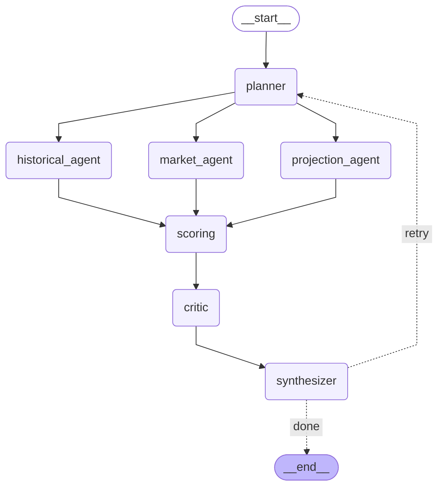

# Sample Outputs – NBA Multi-Agent Betting Advisor

Generated: 2026-03-12 14:05

## Agent Graph

---

## Demo 1: Should I bet Stephen Curry over 28.5 points tonight?

**Parsed**: player=`Stephen Curry`, metric=`points`, threshold=`28.5`

### Scorecard

| Field | Value |
|---|---|
| Decision | **AVOID** |
| Confidence | 61.9% |
| Model Probability | 35.9% |
| Market Implied | N/A |
| Expected Value | +0.00% |
| Best Book | None |
| Eligible | No |
| Pass Reason | no market price available |

**Data Quality Flags**: no_market_data

### Dimension Signals

| Dimension | Signal | Reliability | Detail |
|---|---|---|---|
| historical | under | 0.82 | The historical data indicates a tendency to go under, with a hit rate of 32.56%  |
| trend_role | neutral | 0.82 | Current trends show a neutral effect with no significant changes in performance. |
| shooting | neutral | 0.82 | Shooting percentages are stable, with no significant deviations from the season  |
| variance | neutral | 0.82 | High variance (CV of 0.396) indicates unpredictable performance, which is a conc |
| schedule | neutral | 0.82 | The player's schedule shows no back-to-back games and adequate rest, but this is |
| projection | unavailable | 0.00 | Projection data is unavailable due to dummy data exclusion. |
| market | unavailable | 0.00 | No market data available, indicating a lack of consensus or confidence in the be |

### Critic Risk Factors

- No market price available, indicating a lack of consensus or interest in the bet.
- High variance (CV of 0.396) suggests unpredictable outcomes.
- Small sample size (base stats n = 43) may not provide a reliable estimate.
- Conflicting signals with a neutral trend despite a base stats signal indicating an 'under'.
- Deterministic score confidence (0.619) may be overconfident given the lack of market data.
- CRITIC RECOMMENDS DOWNGRADE TO AVOID

### Summary

The decision to avoid betting is based on the absence of market data, which creates uncertainty in the consensus. The model's probability is lower than the confidence level, suggesting overconfidence in the prediction. Additionally, high variance and a small sample size raise concerns about reliability, reinforcing the recommendation to avoid this bet.

---

## Demo 2: Is Giannis under 12.5 rebounds a good bet?

**Parsed**: player=`Giannis Antetokounmpo`, metric=`rebounds`, threshold=`12.5`

### Scorecard

| Field | Value |
|---|---|
| Decision | **AVOID** |
| Confidence | 48.7% |
| Model Probability | 29.1% |
| Market Implied | N/A |
| Expected Value | +0.00% |
| Best Book | None |
| Eligible | No |
| Pass Reason | no market price available |

**Data Quality Flags**: high_variance (cv=0.42), no_market_data

### Dimension Signals

| Dimension | Signal | Reliability | Detail |
|---|---|---|---|
| historical | under | 0.65 | The player's historical performance indicates a tendency to score under the expe |
| trend_role | neutral | 0.65 | Current trend shows a neutral performance with rolling averages suggesting no si |
| shooting | neutral | 0.65 | Shooting metrics are neutral, indicating no significant changes in shooting effi |
| variance | caution | 0.65 | High variance (cv=0.42) suggests unpredictable performance, making it difficult  |
| schedule | neutral | 0.65 | The player has had 2 days of rest and is not in a back-to-back situation, which  |
| projection | unavailable | 0.00 | Projection data is unavailable due to dummy data exclusion. |
| market | unavailable | 0.00 | No market data available, limiting the ability to assess betting opportunities. |

### Critic Risk Factors

- High variance indicated by cv=0.42 suggests unpredictable performance.
- No market data available, making it difficult to gauge market sentiment and line movement.
- The model probability (0.2912) is low and does not align with a strong betting recommendation.
- The expected value percentage is 0.0, indicating no edge in betting.
- The trend adjustment and shooting adjustment are both negative, which could indicate declining performance.
- The sample size for base stats (n=36) may be too small to draw reliable conclusions.
- CRITIC RECOMMENDS DOWNGRADE TO AVOID

### Summary

Given the high variance in the player's performance, lack of market data, and low model probability, the recommendation is to avoid placing a bet. The adjustments to the base rate indicate a negative trend, and the expected value percentage is zero, suggesting no edge in betting. The overall analysis points to significant uncertainty regarding the player's performance.

---

## Demo 3: Should I bet A.J. Green over 10.5 points when Giannis is out?

**Parsed**: player=`A.J. Green`, metric=`points`, threshold=`10.5`

### Scorecard

| Field | Value |
|---|---|
| Decision | **AVOID** |
| Confidence | 75.0% |
| Model Probability | 37.5% |
| Market Implied | N/A |
| Expected Value | +0.00% |
| Best Book | None |
| Eligible | No |
| Pass Reason | no market price available |

**Data Quality Flags**: high_variance (cv=0.58), no_market_data

### Dimension Signals

| Dimension | Signal | Reliability | Detail |
|---|---|---|---|
| historical | neutral | 1.00 | The historical data shows a hit rate of 46.88% over a sample size of 64, indicat |
| trend_role | under | 1.00 | Recent trends indicate a downward performance with a rolling average of 4.67 ove |
| shooting | neutral | 1.00 | Current shooting percentages are neutral, but recent performance has been poor,  |
| variance | caution | 1.00 | High variance (cv=0.58) suggests unreliable predictions, indicating caution is w |
| schedule | neutral | 1.00 | The player has 2 days of rest and is not in a back-to-back situation, which is n |
| projection | unavailable | 0.00 | Projection data is unavailable due to dummy data exclusion. |
| market | unavailable | 0.00 | No market data available, limiting understanding of market sentiment. |

### Critic Risk Factors

- High variance indicated by cv=0.58 suggests unreliable predictions.
- No market data available, which limits understanding of market sentiment.
- The model probability (0.3747) is significantly lower than the base rate (0.4747), indicating potential overconfidence in the model's adjustments.
- The adjustments made to the scorecard (trend_adj, shoot_adj, combined_ts_capped) all negatively impact the score, suggesting a lack of strong supporting data.
- CRITIC RECOMMENDS DOWNGRADE TO AVOID

### Summary

The decision to avoid betting is based on high variance in predictions, lack of market data, and a model probability that is lower than the base rate. The recent trend shows a decline in performance, and shooting statistics indicate a cold streak. Overall, the data suggests that this is not a favorable betting opportunity.

---

## Demo 4: Who is more consistent for assists overs, Haliburton or Brunson?

**Parsed**: player=``, metric=`assists`, threshold=`0`

### Scorecard

| Field | Value |
|---|---|
| Decision | **AVOID** |
| Confidence | 75.0% |
| Model Probability | 65.3% |
| Market Implied | N/A |
| Expected Value | +0.00% |
| Best Book | None |
| Eligible | No |
| Pass Reason | no market price available |

**Data Quality Flags**: high_variance (cv=0.81), no_market_data

### Dimension Signals

| Dimension | Signal | Reliability | Detail |
|---|---|---|---|
| historical | over | 1.00 | The historical data indicates a strong tendency to go over, with a hit rate of 8 |
| trend_role | under | 1.00 | Recent trends show a decline, with the last 3 games averaging only 1.0, suggesti |
| shooting | neutral | 1.00 | Shooting performance is neutral overall, but recent games show a significant dro |
| variance | caution | 1.00 | High variance (cv=0.81) indicates unpredictable performance, which raises concer |
| schedule | neutral | 1.00 | The player has 2 days of rest and is not in a back-to-back situation, which typi |
| projection | unavailable | 0.00 | Projection data is not available due to dummy data exclusion. |
| market | unavailable | 0.00 | No market data available, leading to uncertainty in betting lines. |

### Critic Risk Factors

- High variance indicated by cv=0.81 suggests unpredictable performance.
- No market data available, leading to uncertainty in betting lines.
- Conflicting signals between base stats (over) and trend (under) could indicate unreliable predictions.
- Sample size of 64 may not be sufficient to draw strong conclusions, especially with high variance.
- CRITIC RECOMMENDS DOWNGRADE TO AVOID

### Summary

Given the high variance in performance and the absence of market data, the recommendation is to avoid placing a bet. The conflicting signals from historical performance and recent trends further contribute to the uncertainty, making this a risky proposition.

---

## Demo 5: Should I bet Victor Wembanyama over 22.5 PRA?

**Parsed**: player=`Victor Wembanyama`, metric=`pra`, threshold=`22.5`

### Scorecard

| Field | Value |
|---|---|
| Decision | **AVOID** |
| Confidence | 75.0% |
| Model Probability | 90.9% |
| Market Implied | N/A |
| Expected Value | +0.00% |
| Best Book | None |
| Eligible | No |
| Pass Reason | no market price available |

**Data Quality Flags**: no_market_data

### Dimension Signals

| Dimension | Signal | Reliability | Detail |
|---|---|---|---|
| historical | over | 1.00 | The historical data shows a strong tendency to go over with a hit rate of 92.86% |
| trend_role | over | 1.00 | Recent trends indicate an upward trajectory in performance, with the last 3 game |
| shooting | neutral | 1.00 | Shooting percentages are solid but do not indicate a strong directional bias, wi |
| variance | neutral | 1.00 | The variance is moderate, indicating some unpredictability in performance outcom |
| schedule | neutral | 1.00 | The player has had 2 days of rest and is not in a back-to-back situation, which  |
| projection | unavailable | 0.00 | Projection data is not available due to exclusion of dummy data. |
| market | unavailable | 0.00 | No market data is available, indicating a lack of consensus or confidence in the |

### Critic Risk Factors

- No market price available, indicating a lack of consensus or confidence in the bet.
- High confidence level (0.75) with no market data to support it, suggesting overconfidence.
- Potential double-counting risk with trend and shooting adjustments, as both may reflect similar underlying performance.
- Sample size of 56 may not be sufficient to draw strong conclusions, especially with high variance (CV of 0.275).
- Stale roster assumptions with only one active teammate and no conflicting injury reports, but the absence of market data raises concerns.
- CRITIC RECOMMENDS DOWNGRADE TO AVOID

### Summary

Given the absence of market data and the high level of uncertainty indicated by the variance, it is recommended to avoid placing a bet on this player prop. While historical and trend data suggest a tendency to go over, the lack of market consensus and potential overconfidence in the model's predictions warrant caution.

---

