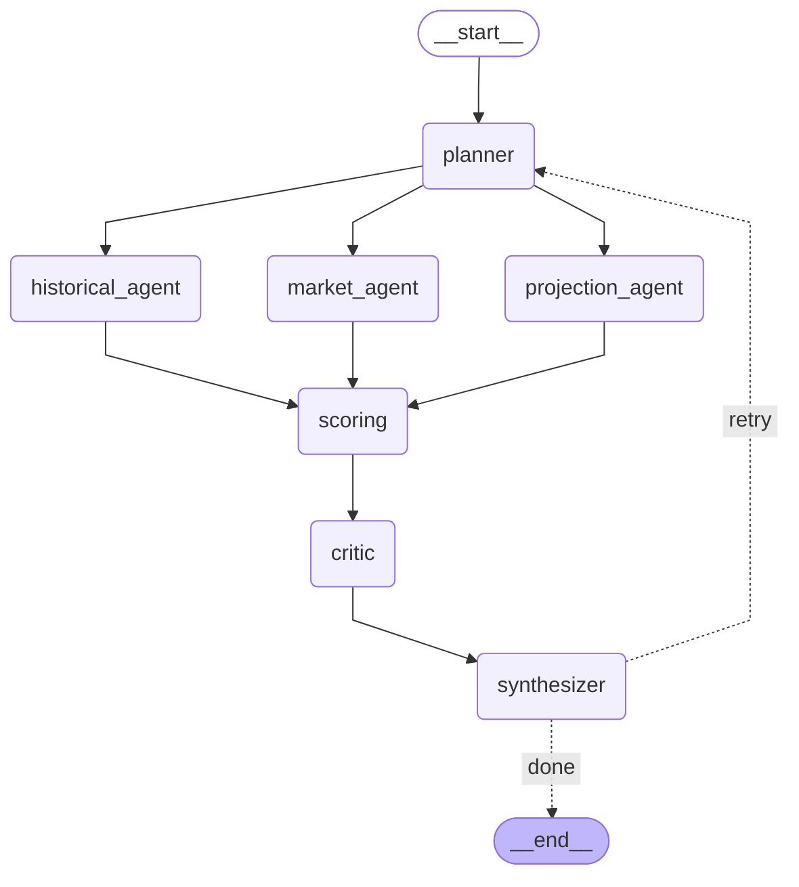

```mermaid
---
config:
  flowchart:
    curve: linear
---
graph TD;
	__start__([<p>__start__</p>]):::first
	planner(planner)
	historical_agent(historical_agent)
	projection_agent(projection_agent)
	market_agent(market_agent)
	scoring(scoring)
	critic(critic)
	synthesizer(synthesizer)
	__end__([<p>__end__</p>]):::last
	__start__ --> planner;
	critic --> synthesizer;
	historical_agent --> scoring;
	market_agent --> scoring;
	planner --> historical_agent;
	planner --> market_agent;
	planner --> projection_agent;
	projection_agent --> scoring;
	scoring --> critic;
	synthesizer -. &nbsp;done&nbsp; .-> __end__;
	synthesizer -. &nbsp;retry&nbsp; .-> planner;
	classDef default fill:#f2f0ff,line-height:1.2
	classDef first fill-opacity:0
	classDef last fill:#bfb6fc

```
